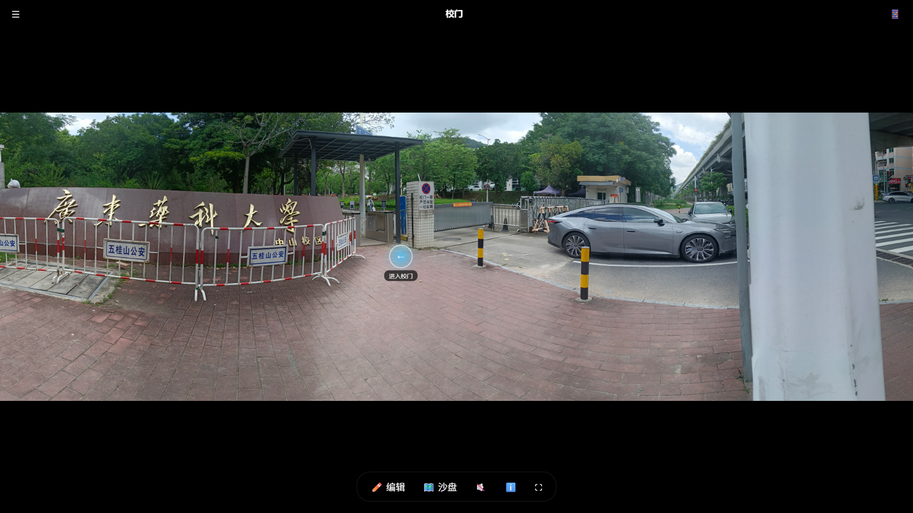
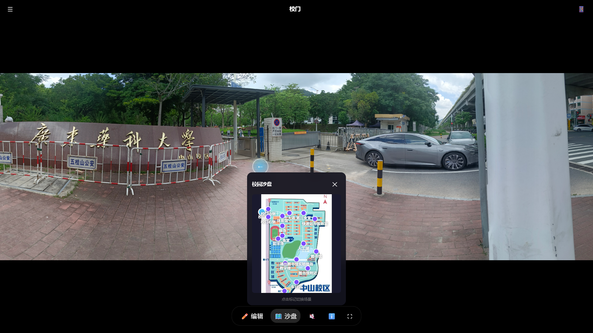

# 校园 AR 全景漫游系统

<div align="center">
  
  <p><em>全景漫游 · 带热点标记的交互界面</em></p>
</div>

基于 Web 的交互式校园导览应用，支持全景浏览、场景切换、沙盘导览和 WebXR AR 沉浸模式。

<div align="center">
  <a href="https://gdpu-ar.vercel.app" target="_blank">
    
  </a>
</div>

<div align="center">
  <a href="#-功能特性">功能特性</a> •
  <a href="#-快速开始">快速开始</a> •
  <a href="#-项目结构">项目结构</a> •
  <a href="#-场景一览">场景一览</a> •
  <a href="#-api-接口">API 接口</a>
</div>

## 技术栈

- **后端**：Node.js + Express
- **前端**：原生 JavaScript (ES Modules)
- **3D/AR**：Three.js + WebXR API
- **数据**：静态 JSON
- **媒体**：全景图 JPG + 语音导览 MP3

## 项目结构

```
├── backend/              # Express 后端 API 服务
│   ├── server.js         # 主入口（端口 3000）
│   ├── routes/           # 路由模块
│   └── utils/            # 工具模块
├── frontend/             # 前端 SPA 应用
│   ├── index.html        # 入口页面
│   ├── css/              # 样式文件
│   ├── js/               # 脚本模块
│   │   ├── app.js        # 主应用入口
│   │   ├── viewer.js     # 全景查看器
│   │   ├── scenes.js     # 场景管理器
│   │   ├── ui.js         # UI 控制器
│   │   └── ar.js         # AR 模式
│   └── assets/           # 静态资源（地图、纹理等）
├── data/
│   └── scenes.json       # 18 个校园场景数据
├── media/
│   ├── panoramas/        # 20 张 360° 全景图
│   └── audio/            # 语音导览（预留）
```

## 快速开始

```bash
# 1. 安装后端依赖
cd backend
npm install

# 2. 启动服务
npm start

# 3. 打开浏览器访问
# http://localhost:3000
```

服务监听 `0.0.0.0:3000`，支持局域网访问。

### 在线体验

[https://gdpu-ar.vercel.app](https://gdpu-ar.vercel.app)

## API 接口

| 端点 | 方法 | 说明 |
|---|---|---|
| `/api/scenes` | GET | 获取所有场景摘要 |
| `/api/scenes/:id` | GET | 获取单个场景详情 |
| `/api/scenes/:id/hotspots` | GET | 获取场景热点列表 |
| `/api/visit/record` | POST | 记录访问日志 |

## 功能特性

| | |
|---|---|
| **🖼️ 全景漫游** — 360° 场景沉浸式浏览，淡入切换动画 | **📍 热点交互** — 场景间跳转、信息展示、方向指引 |
| **🗺️ 沙盘导览** — Canvas 校园地图，标点点击跳转 | **🥽 AR 模式** — WebXR 沉浸式体验（支持设备自动检测） |
| **✏️ 热点编辑器** — 可视化编辑、拖拽调整、JSON 导出 | **🎵 语音导览** — 场景音频播放控制 |

## 场景一览

<div align="center">
  <table>
    <tr>
      <td align="center"><br/><b>校门</b></td>
      <td align="center"><br/><b>主大道</b></td>
      <td align="center"><br/><b>十字路口</b></td>
    </tr>
    <tr>
      <td align="center"><br/><b>图书馆</b></td>
      <td align="center"><br/><b>操场</b></td>
      <td align="center"><br/><b>人工湖</b></td>
    </tr>
  </table>
</div>

共 **18 个校园场景**：校门、校门内侧、校门右侧、主大道、十字路口、第三食堂、通往操场路、操场、体育馆、南门、南门内侧、教学楼、通往图书馆实验楼路、一二食堂、篮球场、人工湖、图书馆、图书馆附近、快递站与医务室、车行道。

## 沙盘地图


